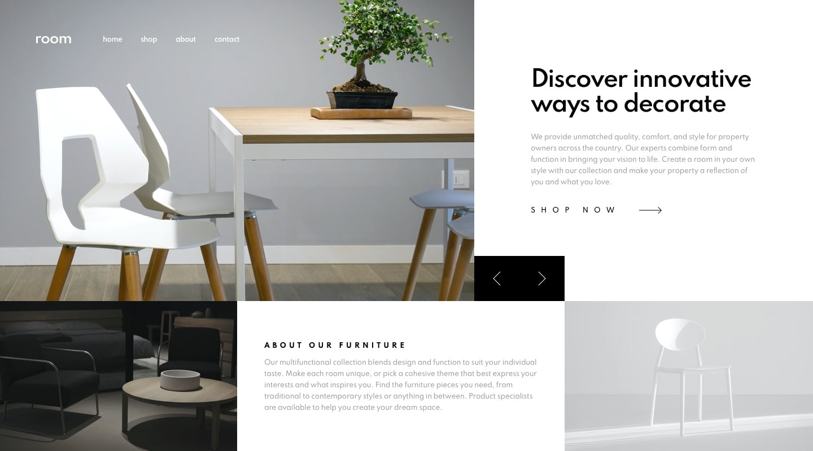

# Frontend Mentor - Room homepage solution

This is a solution to the [Room homepage challenge on Frontend Mentor](https://www.frontendmentor.io/challenges/room-homepage-BtdBY_ENq). Frontend Mentor challenges help you improve your coding skills by building realistic projects.

## Table of contents

- [Overview](#overview)
  - [The challenge](#the-challenge)
  - [Screenshot](#screenshot)
  - [Links](#links)
- [My process](#my-proacess)
  - [Built with](#built-with)
- [Author](#author)

## Overview

### The challenge

Users should be able to:

- View the optimal layout for the site depending on their device's screen size
- See hover states for all interactive elements on the page
- Navigate the slider using either their mouse/trackpad or keyboard

### Screenshot

### Links

- Solution URL: [https://github.com/jpdrsanchez/next-room-homepage-master](https://github.com/jpdrsanchez/next-room-homepage-master)
- Live Site URL: [https://next-room-homepage-master.vercel.app/](https://next-room-homepage-master.vercel.app/)

## My process

### Built with

- Semantic HTML5 markup
- CSS custom properties
- CSS Animations
- Flexbox
- CSS Grid
- Mobile-first workflow
- [React](https://reactjs.org/) - JS library
- [Next.js](https://nextjs.org/) - React framework
- [Styled Components](https://styled-components.com/) - For styles

## Author

- Website - [João Pedro Sanchez](https://jpdrsanchez.github.io/)
- Frontend Mentor - [@jpdrsanchez](https://www.frontendmentor.io/profile/jpdrsanchez)
- Twitter - [@jpdrsanchez](https://twitter.com/jpdrsanchez)
